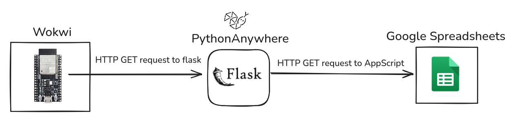

# Wokwi Simulation for Detect Ammonia (NH3) Gas using MQ-135 Sensor

## Topology Design

**Problem**: Mungkin kalian berpikir *kenapa gak langsung send data aja dari ESP32 di Wokwi ke Google Spreadsheets pakai AppScript* ?
**Alasannya**: Karena entah mengapa setiap kirim data dari Wokwi ke Google spreadsheet, HTTP request-nya *selalu gagal* dengan status code: **-1 (connection refused)**. Oleh karena itu, saya cari akal untuk mencari perantaranya, yaitu dengan menggunakan flask app yang di-publish ke ngrok/cloudflare supaya bisa diakses oleh ESP32 di Wokwi (secara publik).

## Requirements

- *Visual Studio Code* untuk mengedit dan menjalankan simulasi.
- Ekstensi VSCode: *PlatformIO* and *Wokwi*.
- *Ngrok* or *Cloudflared* untuk tunneling.

## Usage

- Sebelum di-running, build project PlatformIO terlebih dulu dengan mengklik tanda ✅ yang ada di bawah VSCode.
- Setelah proses build selesai, salin path firmware yang telah di-compile ke bagian `[wokwi]` pada file `wokwi.toml` (ini seharusnya tidak perlu karena hasilnya akan sama saja).
- Untuk menjalankannya, buka file `diagram.json` yang sudah terhubung dengan ekstensi Wokwi, lalu klik tombol play/running.

## Notes

- Karena kita menggunakan custom chips, maka perlu 2 source code tambahan, yaitu `./wokwi/chips/mq135.chip.c` dan `./wokwi/chips/mq135.chip.json`.
- Source code `./wokwi/chips/mq135.chip.c` harus di-compile ke **wasm** supaya bisa dijalankan.
- Untuk menambahkan custom chip di Wokwi, kita perlu header file `wokwi-api.h` yang bisa didapatkan pada contoh custom chip *inverter* yang tersedia di repo berikut: [https://github.com/wokwi/inverter-chip/blob/main/src/wokwi-api.h](https://github.com/wokwi/inverter-chip/blob/main/src/wokwi-api.h).
- Untuk meng-compile dari C ke wasm kita perlu tool `emscripten`. Install tool tersebut dengan perintah: `sudo apt install -y emscripten` (Ubuntu/Debian based distro).
- Terakhir, compile C ke wasm pakai perintah: `emcc mq135.chip.c -o mq135.chip.wasm -s EXPORTED_FUNCTIONS='["_attrInit", "_attrRead", "_pinInit", "_pinDACWrite", "_timerInit", "_timerStart"]' -s ERROR_ON_UNDEFINED_SYMBOLS=0`. Jangan lupa, pindahkan hasil kompilasi wasm tersebut ke folder `./wokwi/chips/`. Untuk namanya samakan saja dengan nama custom chip-nya, yaitu `./wokwi/chips/mq135.chip.wasm`.
- Catatan tambahan: untuk variabel `FLASK_APP_URL` pada file `./wokwi/src/main.cpp` kalian bisa isikan dengan **url flask app yang running**, bisa di local atau pun di upload ke [pythonanywhere.com](https://pythonanywhere.com) supaya bisa diakses dari internet. Syaratnya adalah jika flask app running di local, maka harus diekspos ke publik/internet menggunakan tunelling, seperti *Ngrok*/*Cloudflared*.

## Attachments

- [Sample Google Sheets](https://docs.google.com/spreadsheets/d/10ahD_GUE2ebamJ2kfBSvB5ndD5VfSDZ6henEgFErZkQ/edit?usp=sharing)
- [Wokwi Project](https://wokwi.com/projects/423022837140786177)
- [Video Simulation](https://mega.nz/file/PUwEGS4B#qgLI2ZcU1Pab8HAguwFwNwRe09544eH5V2b1BQy-nxc)

## Credits

- [pythonanywhere](https://pythonanywhere) by Anaconda.

